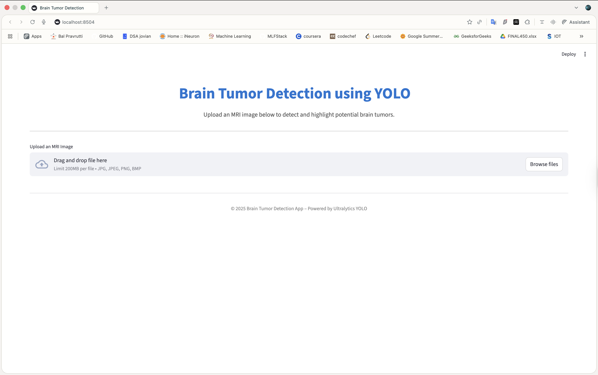
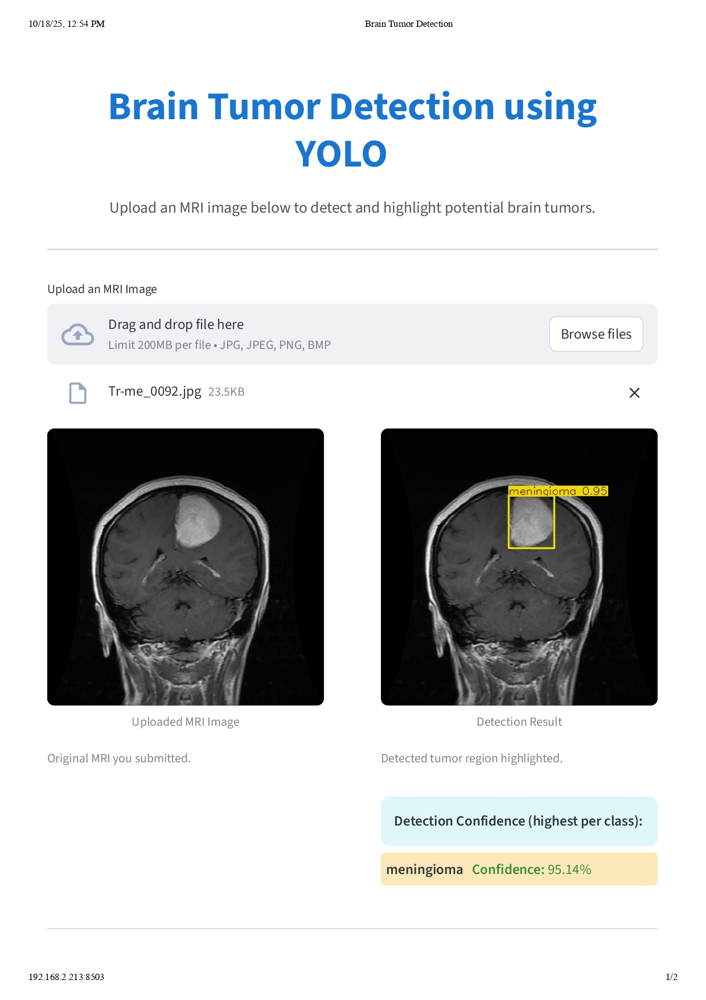

# Brain Tumor Detector

This project leverages deep learning to classify brain tumors from MRI scans. It provides a comprehensive solution including a trained model, a Streamlit application for easy inference, and a detailed Jupyter notebook for model training and evaluation.

## 📋 Table of Contents

*   [Files](#files)
*   [Setup](#setup)
    1.  [Clone the repository](#1-clone-the-repository)
    2.  [(Optional) Create and activate a virtual environment](#2-optional-create-and-activate-a-virtual-environment)
    3.  [Install dependencies](#3-install-dependencies)
*   [Usage](#usage)
    *   [Run Streamlit App](#run-streamlit-app)
    *   [Train or Explore the Model](#train-or-explore-the-model)
*   [Screenshots](#screenshots)
*   [Notes & Troubleshooting](#notes--troubleshooting)
*   [License](#license)
*   [Contact](#contact)

---

## 📁 Files

*   `app.py`: The Streamlit application interface. Use this to upload MRI images and get real-time predictions of tumor presence (tumor/no tumor).
*   `brain_tumor_detector.ipynb`: A Jupyter notebook containing the full workflow for data loading, preprocessing, model definition (CNN), training, evaluation, and saving the final model. This notebook is where the deep learning model is developed.
*   `requirements.txt`: A list of all Python dependencies required to run the project (e.g., `streamlit`, `tensorflow`, `Pillow`, `numpy`).
*   `model/`: This directory is intended to house the trained deep learning model weights.
    *   `model/brain_tumor_model.h5`: The pre-trained Keras model file. This file contains the learned weights and architecture for making predictions.
*   `screenshots/`: Contains images used in this README to illustrate the application's interface.
*   `.gitignore`: Configures Git to ignore specified files and directories (like `__pycache__` or virtual environment folders), preventing them from being committed to the repository.

---

## 🛠️ Setup

Follow these steps to set up the project on your local machine.

### 1. Clone the repository

First, clone the project repository from GitHub:

```bash
git clone https://https://github.com/pranjalparmar/brain_tumor_detector.git
cd brain_tumor_detector
```

### 2. (Optional) Create and activate a virtual environment

It's highly recommended to use a virtual environment to manage project-specific dependencies and avoid conflicts with other Python projects:

```bash
python -m venv venv
```
Activate the virtual environment:
*   **On macOS/Linux:**
    ```bash
    source venv/bin/activate
    ```
*   **On Windows:**
    ```bash
    .\venv\Scripts\activate
    ```

### 3. Install dependencies

Install all required Python packages using `pip`:

```bash
pip install -r requirements.txt
```

---

## 🚀 Usage

### Run Streamlit App

To start the Streamlit web application:

```bash
streamlit run app.py
```

Once the app is running, open your web browser and navigate to `http://localhost:8501`. You can then upload MRI scans (in `.jpg`, `.jpeg`, or `.png` format). The app will display the predicted result ("Tumor Detected" or "No Tumor") along with a confidence score.

**Important Note:** The trained model file (`model/brain_tumor_model.h5`) **must be present** in the `model/` directory for the Streamlit app to function correctly. If this file is missing, the application will not be able to load the model for predictions.


### Train or Explore the Model

To understand the model's architecture, train a new model, or evaluate its performance:

Open the `brain_tumor_detector.ipynb` notebook in your preferred Jupyter environment (Jupyter Notebook or JupyterLab). Within the notebook, you can:

*   Load and preprocess your MRI dataset.
*   Define, train, and optimize the deep learning model.
*   Evaluate the model's accuracy and other performance metrics.
*   Save your newly trained model as `brain_tumor_model.h5` inside the `model/` directory.

---

## 📸 Screenshots

Below are some screenshots illustrating the application's interface and functionality.

**Application Home Page:**






---

## ⚠️ Notes & Troubleshooting

*   The `model/brain_tumor_model.h5` file **is crucial** for the Streamlit app's functionality. Ensure it is placed correctly in the `model/` directory. If it's missing, you will need to retrain the model using the provided Jupyter notebook or place a pre-trained model there.
*   Ensure that you only upload MRI image files (`.jpg`, `.jpeg`, `.png`) to the Streamlit application to avoid errors.
*   If you encounter dependency issues, try recreating your virtual environment and reinstalling packages.
*   For optimal performance, a GPU is recommended for model training, but inference can run on a CPU.

---

## 📄 License

This project is provided for educational and research purposes only. It is not intended for clinical use or diagnostic purposes.

---

## 📧 Contact

This project was created by Pranjal Parmar. For any questions, issues, or collaboration opportunities, please open an issue on the GitHub repository.

---
